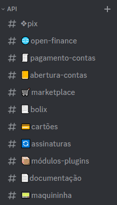

<h1 align="center">Efí Pay no Discord</h1>

Se você tem a necessidade de integrar seu sistema ou aplicação a uma API completa de pagamentos, desejos de trocar experiências e compartilhar seu conhecimento, conecte-se à comunidade da Efí no Discord.

## Sumário

- [O que é](#o-que-é)
- [Como participar](#como-participar)
- [Comportamento](#comportamento)
- [Efí](#efí-pay)

## O que é

O servidor da Efí no Discord foi criado para aproximar desenvolvedores e interessados em integrar com a Efí Pay, dar suporte e promover nossa API Pix e API cobranças. O diálogo por aqui é mais rápido e dinâmico, o que permite uma abordagem mais informal e personalizada. Além disso, você pode usar o canal para tirar dúvidas com outros integradores, tornando esse espaço uma sólida rede de apoio.

Para evitar descontentamentos e um ambiente prejudicial, criamos algumas regrinhas simples para as interações realizadas. Você encontra estas regras entrando em nosso servidor. Afinal, queremos que esse seja um ambiente seguro, íntegro e aberto a trocas de experiências.

## Como participar

Para acessar a nossa comunidade, basta entrar no nosso [servidor](https://discord.gg/ptGHMtczcV).
Lembrando que para isso, é necessário que você crie uma [conta no Discord](https://discord.com/register).

Com o intuito de separar por tópicos os assuntos abordados, criamos grupos específicos para facilitar a comunicação. Para ajudar, listamos abaixo alguns dos canais disponíveis:

## Comportamento

O Discord Efí não é um lugar para insultar, antagonizar ou sexualizar pessoas. Seja gentil e respeitoso em suas publicações e comentários, mesmo quando houver divergências de opinião na discussão. Não são aceitos, em nenhuma circunstância, conteúdos e comentários preconceituosos, racistas, homofóbicos e/ou ofensivos de qualquer natureza. Aqui também não é um espaço para comentários sobre aspectos físicos de participantes do grupo e colaboradores da Efí.

Nesse sentido, o que esperamos de você enquanto membro ativo da comunidade, é poder tirar dúvidas sobre as APIs Efí Pay e engajar com outros usuários.

## Efí Pay

A Efí oferece aos clientes uma Conta Digital gratuita, com automatização completa dos processos financeiros, redução de custos e controle simplificado das cobranças, sejam elas por Pix, Boleto/Bolix, Carnês, Cartões, Marketplace (split de pagamentos), Links de Pagamento, Carnês ou Assinaturas.

Para conhecer um pouco mais sobre a Efí, acompanhe-nos nas redes sociais:

    
    
    
    
        

